# Dharura.AI 

Dharura.AI is an AI-powered First Aid assistant designed to provide instant medical guidance for emergencies. It uses the Friendli.ai API and the Llama 3.3 70B instruct model from Meta to deliver step-by-step First Aid instructions and severity assessments in multiple languages.

---

## Live Links🌐📶

- **🚀Live Link on Vercel:** https://dharura-ai.vercel.app/chat

--- 

## 📜 Table of Contents

- [Overview](#overview)
- [Features](#features)
- [System Architecture](#system-architecture)
- [Getting Started](#getting-started)
- [Environment Setup](#environment-setup)
- [Usage](#usage)
- [Contributing](#contributing)

--- 

## Overview

This diagram provides an overview of how the Dharura.AI system works, from user input to delivering First Aid guidance using the Friendli.ai API and the Llama 3.3 70B instruct model from Meta.

```mermaid
graph TD
    %% Define Components
    subgraph UserLayer["👤 User Interaction"]
        User[🧑‍🚒 User]
    end

    subgraph Frontend["🎨 Frontend (React.js)"]
        UI[Emergency Input & First Aid Display]
    end

    subgraph Backend["🌐 Backend (Friendli.ai API)"]
        API[Friendli.ai API]
    end

    subgraph AIEngine["🤖 AI Processing (Meta)"]
        Llama[Llama 3.3 70B - First Aid Model]
    end

    subgraph ResponseHandler["⚙️ Response Processing"]
        Severity[🔢 Severity Assessment]
        Guidance[💬 First Aid Guidance Generation]
        LangDetect[🌍 Language Detection]
        ErrorHandler[⚠️ Error Handling & Fallback Response]
    end

    %% Data Flow
    User -->|Describes Emergency| UI
    UI -->|Sends Emergency Request| API
    API -->|Forwards Request| Llama
    Llama -->|Returns Guidance| API
    API -->|Assesses Severity| Severity
    API -->|Generates Steps| Guidance
    API -->|Detects Language| LangDetect
    API -->|Handles Errors if Any| ErrorHandler
    ErrorHandler -->|Fallback Response if Needed| API
    API -->|Sends Processed Response| UI
    UI -->|Displays Guidance| User
    User -->|Follows Steps or Asks More| UI

    %% Define Class Styles
    classDef userLayer fill:#ffccbc,stroke:#ff7043,stroke-width:2px,color:#bf360c
    classDef frontend fill:#bbdefb,stroke:#1976d2,stroke-width:2px,color:#0d47a1
    classDef backend fill:#ffcdd2,stroke:#c62828,stroke-width:2px,color:#b71c1c
    classDef aiEngine fill:#d1c4e9,stroke:#7e57c2,stroke-width:2px,color:#4a148c
    classDef responseHandler fill:#c8e6c9,stroke:#388e3c,stroke-width:2px,color:#1b5e20

    %% Apply Classes
    class User userLayer
    class UI frontend
    class API backend
    class Llama aiEngine
    class Severity,Guidance,LangDetect,ErrorHandler responseHandler

```


--- 

### Explanation:

- **User**: The user interacts with the application.
 - **Language**: The user selects the language to request for first aid from.
- **Frontend (React.js)**: The frontend of the application built using React.js.
  - **Emergency Input**:The user describes their medical emergency in a chat interface.
  - **First Aid Display**:Step-by-step First Aid instructions and severity levels are displayed to the user
- **Friendli.ai API**: The API that sends the emergency description to the Llama 3.3 70B instruct model for processing.
- **Llama 3.3 70B Instruct Model (Hugging Face)**: The pretrained model hosted by Hugging Face that analyzes and refines the code.

---

- **Flow**:

  1. The User Selcts language in which they want to as First Aid from.
  2. The user describes their emergency through the frontend chat interface.
  3. The frontend sends the emergency details to the Friendli.ai API.
  4. The Friendli.ai API forwards the request to the Llama 3.3 70B instruct model.
  5. The model returns First Aid guidance and a severity assessment to the Friendli.ai API.
  6. The Friendli.ai API sends the guidance back to the frontend.
  7. The frontend displays the guidance and severity to the user
  8. The user can follow the steps or ask follow-up questions if needed.
  9. The frontend sends additional queries to the Friendli.ai API as required.
  10. The API forwards these queries to the Llama 3.3 70B instruct model.
  11. The model returns updated guidance to the Friendli.ai API.
  12. The API sends the updated guidance back to the frontend.

---

  ## Features
- **First Aid Guidance:** Receive clear, step-by-step instructions for handling medical emergencies.
- **Severity Assessment:** Get an AI-assessed urgency level (Urgent, Moderate, Low) for each situation.
- **Multilingual Support:** Access guidance in languages like English, Spanish, Swahili, Arabic, and more.
- **Responsive Design:** Seamless experience across various devices.

---


## System Architecture

```mermaid
---
title: Dharura.AI System Architecture
---

sequenceDiagram
    participant User as 👤 User
    participant Frontend as 🎨 Frontend (React.js)
    participant Backend as 🌐 Backend (Friendli.ai API)
    participant AIEngine as 🤖 AI Engine (Llama 3.3 70B)
    participant Fallback as ⚠️ Fallback Response Logic
    participant Database as 🗄️ Database (Storage)

    User->>Frontend: 🟦 1. Describes emergency
    Frontend->>Backend: 🟦 2. Sends emergency & language request
    Backend->>AIEngine: 🟩 3. Forwards request to AI model
    AIEngine-->>Backend: 🟩 4. Returns guidance (severity, steps, language)
    Backend->>Frontend: 🟦 5. Processes response and sends guidance
    alt Error occurs
        Backend->>Fallback: 🟥 6. Triggers fallback response
        Fallback-->>Backend: 🟥 7. Returns fallback guidance
    end
    Backend->>Database: 🟪 8. Stores guidance results
    Database-->>Backend: 🟪 9. Retrieves stored guidance data
    Backend->>Frontend: 🟦 10. Sends processed guidance to frontend
    Frontend->>User: 🟦 11. Displays guidance and severity

    note over Backend,AIEngine: 🟩 Secure API Communication
    note over Backend,Database: 🟪 Stores guidance for future reference
    note over Frontend: 🟦 Allows users to ask follow-ups
```


---

### Component Architecture

```mermaid
---
title: Dharura.AI Component Architecture
---

graph TD
    subgraph Frontend["🎨 Frontend (React.js)"]
        UI["🖥️ UI Components"]
        Router["🛤️ React Router DOM"]
        APIHandler["🔄 API Handler"]
    end

    subgraph Backend["🌐 Backend (Friendli.ai API)"]
        AuthServer["🔐 Authentication Server"]
        API["📡 API Gateway"]
        Logic["⚙️ Business Logic"]
        ModelHandler["🤖 AI Model Handler"]
    end

    subgraph AIEngine["🧠 AI Engine (Llama 3.3 70B)"]
        NLPModel["📊 NLP Processing"]
        ResponseGen["📝 Response Generation"]
    end

    subgraph Fallback["⚠️ Fallback Logic"]
        DefaultResponse["🔄 Default Guidance"]
    end

    subgraph Database["🗄️ Database (Storage)"]
        Reviews["📑 Guidance Records"]
        Logs["📜 User Logs"]
    end

    %% Arrows and Connections
    UI -->|User Input| Router
    Router --> APIHandler
    APIHandler -->|Sends Requests| API

    API -->|Authenticates| AuthServer
    AuthServer --> API

    API -->|Processes Requests| Logic
    Logic --> ModelHandler
    ModelHandler -->|Sends request| NLPModel
    NLPModel -->|Generates guidance| ResponseGen
    ResponseGen --> ModelHandler
    ModelHandler --> API
    API --> APIHandler
    APIHandler --> UI

    Logic -->|Error Handling| Fallback
    Fallback --> DefaultResponse
    DefaultResponse --> API

    API -->|Store Guidance| Reviews
    API -->|Log Data| Logs

    %% Coloring
    classDef frontend fill:#bbdefb,stroke:#1976d2,stroke-width:2px;
    classDef backend fill:#ffcdd2,stroke:#c62828,stroke-width:2px;
    classDef ai fill:#c8e6c9,stroke:#388e3c,stroke-width:2px;
    classDef fallback fill:#ffe082,stroke:#ff8f00,stroke-width:2px;
    classDef database fill:#b2dfdb,stroke:#00796b,stroke-width:2px;

    class Frontend frontend
    class Backend backend
    class AIEngine ai
    class Fallback fallback
    class Database database

```



---

## Getting Started

### Prerequisites
- Node.js and npm installed on your machine.
- A Friendli.ai API token

---

### Installation

1. Clone the repository:
```bash
git clone https://github.com/
cd dharura-ai
```

2. Install dependencies:
```bash
npm install
```
---


## Environment Setup

Create a .env file in the root directory


**Start the development server:**
```bash
npm run dev
```
--- 

## Usage
1. Navigate to the chat interface on the landing page or /chat route.
2. Describe your medical emergency in the input field and select your language.
3. Review the step-by-step First Aid guidance and severity assessment.
4. Follow the provided steps or ask follow-up questions as needed.
5. Use the guidance to address the emergency or seek professional help if advised.

---

## Contributing

Contributions are welcome! Please open an issue or submit a pull request if you have any suggestions or improvements.
